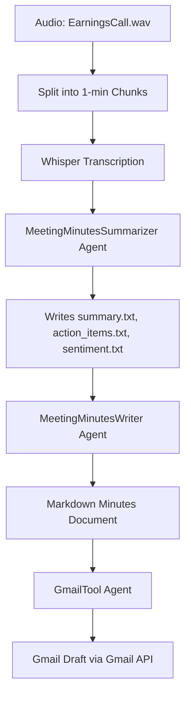

   

# 🚀 meeting_minutes: The Ultimate GenAI-Powered Meeting Automation Suite

> A high-performance, extensible, multi-agent AI system that **transcribes**, **summarizes**, **analyzes sentiment**, **extracts action items**, and **automatically drafts emails** — all in one seamless flow!

> **Unleash the power of generative AI and agentic workflows to supercharge your team’s productivity.**

---

## ✨ Why meeting_minutes?

- Lightning-fast, accurate transcription of audio meetings using OpenAI Whisper.
- Intelligent summarization, action-item extraction, and sentiment analysis via customizable AI agents.
- Fully automated email drafting with Gmail API integration — no more manual follow-ups!
- Modular “crewAI” architecture: define agents, tasks, and tools in simple YAML.
- Enterprise-ready: Scalable, configurable, and easy to extend with your own custom tools.
- Ideal for remote teams, virtual assistants, and next-gen AI product demos.


---

## 📦 Features

| Feature                         | Details                                                                                   |
|---------------------------------|-------------------------------------------------------------------------------------------|
| Transcription                   | Chunk-based WAV processing + Whisper API for crisp, readable transcripts                  |
| Summarization                   | Multi-agent summarizer writes: <ul><li>Concise summary</li><li>Action items</li><li>Sentiment analysis</li></ul> |
| Meeting Minutes Generation      | Seamlessly merges summary, action items & sentiment into a polished Markdown document     |
| Email Drafting                  | GmailTool creates HTML drafts with Markdown-to-HTML conversion                            |
| Config-Driven                   | YAML-based agent & task definitions — tweak prompts & workflows in seconds                |
| Extensibility                   | Drop in custom tools under `src/meeting_minutes/tools` to enhance capabilities            |
| Dev-Friendly                    | Pydantic models, Python 3.10+, pre-configured CLI via `crewai run`                       |

---

## 🔧 Tech Stack

| Technology          | Purpose                                                                 |
|---------------------|-------------------------------------------------------------------------|
| Python 3.10+        | Core language                                                          |
| crewAI              | Agent orchestration & workflow management                               |
| OpenAI Whisper API  | High-quality audio transcription                                        |
| pydub               | Audio chunking & processing                                             |
| Pydantic            | Data validation & state management                                      |
| Google Gmail API    | Programmatic email drafting                                             |
| YAML                | Agent & Task configuration                                               |

---

## 🚀 Quick Start

```bash
# 1. Clone the repo
git clone https://github.com/your-org/meeting_minutes.git
cd meeting_minutes

# 2. Install dependencies
pip install uv crewai[tools] pydub openai google-api-python-client

# 3. Set up credentials
# - Add your OPENAI_API_KEY to a .env file.
# - Place Gmail OAuth credentials.json in src/meeting_minutes/crews/gmailcrew/tools/

# 4. Run!
crewai run
```

Generated outputs will appear:
- `summary.txt` — meeting summary  
- `action_items.txt` — bulletized tasks  
- `sentiment.txt` — tone analysis  
- Draft email ID in console log  

---

## 🛠️ Configuration

1. **Agents**: `src/meeting_minutes/crews/*/config/agents.yaml`  
2. **Tasks**: `src/meeting_minutes/crews/*/config/tasks.yaml`  
3. **Flow Logic**: `src/meeting_minutes/main.py`  
4. **Custom Tools**: add modules under `src/meeting_minutes/tools/`  
5. **Prompts**: Tune in YAML to adapt roles, goals, and backstories  

---

## 📚 How It Works



---

## 🚀 Use Cases

- Automated stand-up recap for remote teams  
- Investor call summarization & follow-up  
- Customer support call analytics  
- Podcast transcription & highlight reel generation  

---

## 🤝 Contributing

1. Fork the repo & create a feature branch  
2. Add or update tools/agents/tasks  
3. Run `pre-commit run --all-files`  
4. Submit a PR with detailed description  

> Let’s redefine how teams collaborate with Agentic AI!  
---
